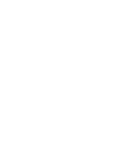
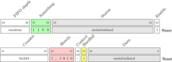
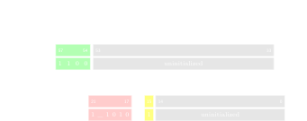
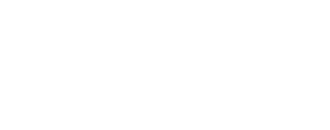

# sphinxcontrib-archware


[](https://sphinxcontrib-archware.readthedocs.io/en/latest/?badge=latest)
[](https://pypi.org/project/sphinxcontrib-archware/)


A Sphinx extension for documenting digital hardware in RST.

It provides directives for rendering
[`bytefield`](https://ctan.org/pkg/bytefield) packet and register diagrams
and [`register`](https://ctan.org/pkg/register) hardware register diagrams
as inline SVG in HTML output, and as native LaTeX floats in PDF output.

## Examples

| Light Mode (default, black stroke) |  Dark Mode (white stroke) |
:-------------------------:|:-------------------------:
| <div style=" background: white" >  </div> | <div style=" background: black" > </div> |
|  <div style=" background: white" >   </div>| <div style=" background: black" >  </div>  |
|  <div style=" background: white" >   </div> | <div style=" background: black" >  </div>  |

## Directives

| Directive | Description |
|---|---|
| `.. bytefield::` | Packet / bit-field diagram |
| `.. register::` | Hardware register diagram with rotated field names and reset values |
| `.. regdesc::` | Field descriptions as searchable HTML text |
| `.. listofregisters::` | Auto-generated list of all register diagrams |

Custom commands `\colorbitbox`, `\bitlabel`, `\rotbitheader`, `\memsection`,
and `\descbox` are always available in every `.. bytefield::` directive with
no extra configuration.

## Installing the Python package

```bash
pip install sphinxcontrib-archware
```

Then add the extension to `conf.py`:

```python
extensions = ["sphinxcontrib.archware"]
```

## Installing the required TeX tools

The extension requires a TeX installation with the `bytefield` and `register`
LaTeX packages, and a tool to convert the compiled output to SVG.

### Debian / Ubuntu

```bash
# TeX Live with the required LaTeX packages
sudo apt install texlive-latex-extra texlive-pictures texlive-science

# SVG converter — dvisvgm is included in texlive-base;
# install inkscape as an alternative if preferred
sudo apt install dvisvgm        # recommended
# or
sudo apt install inkscape
```

### macOS (Homebrew)

```bash
# MacTeX includes all required LaTeX packages and dvisvgm
brew install --cask mactex

# or the smaller BasicTeX distribution, then add the missing packages:
brew install --cask basictex
sudo tlmgr update --self
sudo tlmgr install bytefield register standalone lm
```

### Windows (MiKTeX)

Install [MiKTeX](https://miktex.org/download).  The `bytefield` and
`register` packages will be downloaded automatically on first use.
Install `dvisvgm` via the MiKTeX package manager, or install
[Inkscape](https://inkscape.org/) as the SVG converter.

### Verifying the installation

```bash
latex  --version      # should print a LaTeX version string
dvisvgm --version     # should print a dvisvgm version string
```

## Global package options

Package-level options for the LaTeX packages can be set globally in
`conf.py` and apply to every diagram in the document:

```python
# options forwarded to \usepackage[…]{bytefield}
bytefield_package_options = "bitheight=6ex"

# options forwarded to \usepackage[…]{register}
register_package_options = "botcaption"
```

## Development note

> This package was developed interactively with [Claude](https://claude.ai)
> (Anthropic) as a coding and documentation assistant. All output was
> reviewed and directed by the author.
